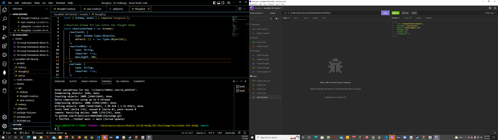

# SNAPIMdB-Challenge
  ## Badge
  
  ## Description 
  A mock back end of a social network using API calls to mongoDB using node, express, mongoose
  ## Table of contents
  - [Installation](#Installation)
  - [Usage](#Usage)
  - [License](#License)
  - [Contributions](#Contributions)
  - [Testing](#Testing)
  - [Repository Link](#Repository)
  - [GitHub Info](#GitHub) 
  ## Installation
  download package.json and run npm i in terminal
  ## Usage
  Use to mock api calls for a social network
  ## License
  
  ## Contributions
  Christopher Hoke AKA James Primitive
  ## Testing
  Test by using insomnia and running npm run start in terminal
  ## Repository
  https://github.com/PrimitiveJ/SNAPIMdB-Challenge
  ## GitHub
  PrimitiveJ
  ## Contact
  hokecj@gmail.com
  This README.md was generated using READLEMETHIS.
##Screenshot

## Video Demonstration
https://youtu.be/YJwsmmUD4lQ